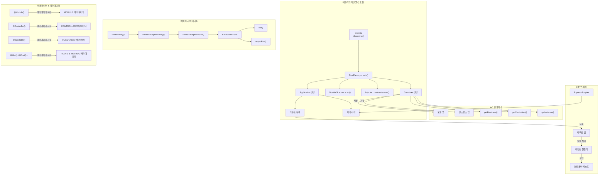

# self_nest
nest 코드를 이해하고자 핵심 원리를 기반으로 한 self nest 만들기

# Directory Structure
```
self_nest/
├── src/
│   ├── core/
│   │   ├── interfaces.ts       - 핵심 인터페이스
│   │   ├── factory.ts          - NestFactory 구현
│   │   ├── application.ts      - 애플리케이션 클래스
│   │   ├── container.ts        - IoC 컨테이너
│   │   ├── exceptions-zone.ts  - 예외 처리 영역
│   │   ├── module-scanner.ts   - 모듈 스캐닝
│   │   └── injector.ts         - 의존성 주입
│   ├── decorators/
│   │   ├── module.decorator.ts - 모듈 데코레이터
│   │   ├── controller.decorator.ts - 컨트롤러 데코레이터
│   │   ├── injectable.decorator.ts - 프로바이더 데코레이터
│   │   └── route.decorator.ts  - 라우트 데코레이터
│   ├── adapters/
│   │   └── http-adapter.ts     - HTTP 어댑터
│   ├── constants/
│   │   └── shared.constants.ts - 공통 상수
│   └── utils/
│       └── shared.utils.ts     - 유틸리티 함수
├── example/
│   ├── app.module.ts           - 예제 모듈
│   ├── app.controller.ts       - 예제 컨트롤러
│   ├── app.service.ts          - 예제 서비스
│   └── main.ts                 - 애플리케이션 시작점
```

# Mermaid Diagram


# 주요 패턴
- 모듈화
- 의존성 주입
- 데코레이터 패턴
- 팩토리 패턴
- 예외 처리
- 모듈 스캐닝


