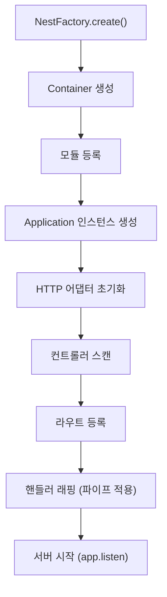
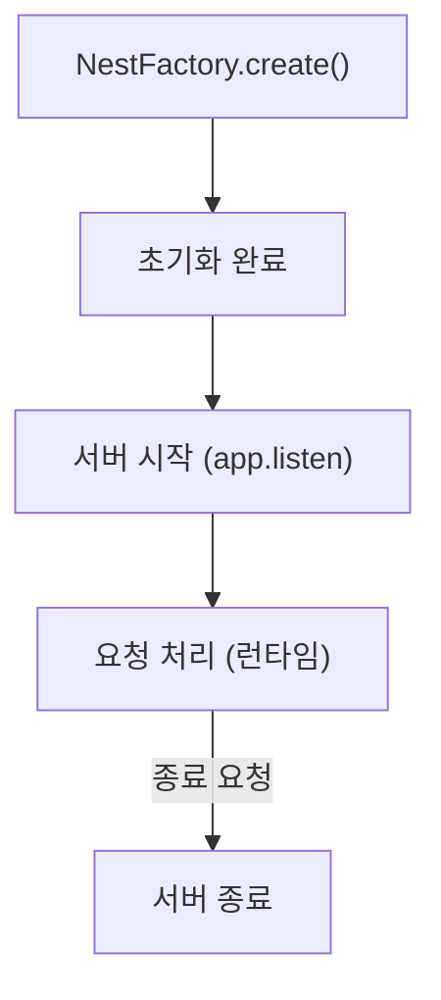
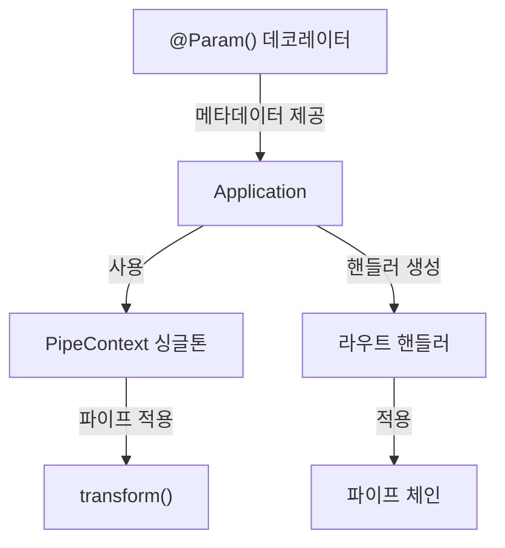
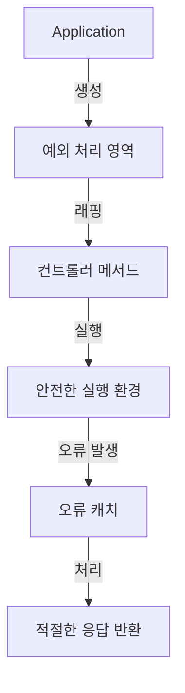
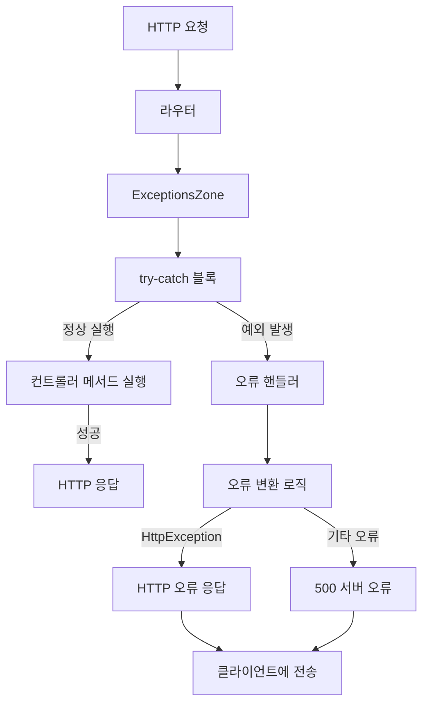
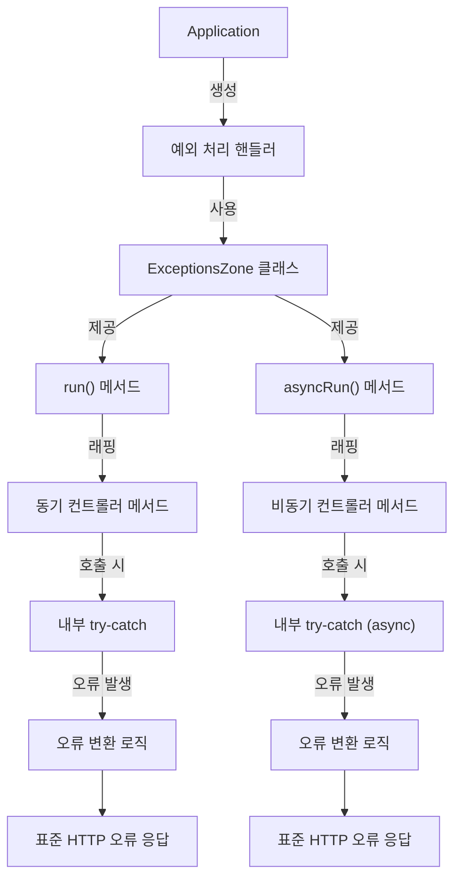

# 애플리케이션 생성 흐름

본 문서는 self_nest 프레임워크의 애플리케이션 생성 및 라이프사이클 관리 과정을 설명합니다.

## 애플리케이션 구성 흐름


## 주요 특징
- 모듈 기반 애플리케이션 구조
- 어댑터 패턴을 통한 HTTP 라이브러리 추상화
- 파이프 시스템을 통한 데이터 변환 및 검증
- 메타데이터 기반 라우트 자동 등록
- 예외 처리 영역을 통한 안정적 오류 관리

## 작동 원리

### 1. 애플리케이션 초기화
- **NestFactory.create()**: 루트 모듈을 시작점으로 애플리케이션 생성
- **Container 생성**: 의존성 관리를 위한 IoC 컨테이너 초기화
- **모듈 스캐너**: 모듈 간 관계 분석 및 의존성 트리 구성

### 2. HTTP 어댑터 설정
- **ExpressAdapter 생성**: HTTP 요청/응답 처리를 위한 어댑터 초기화
- **미들웨어 등록**: 공통 기능을 위한 미들웨어 파이프라인 구성
- **기반 설정**: JSON 파싱, 정적 파일 제공 등 기본 설정

### 3. 라우트 시스템 구성
- **컨트롤러 스캔**: 컨트롤러 메타데이터 분석으로 라우트 정보 추출
- **라우트 맵 구성**: HTTP 메서드와 경로를 컨트롤러 메서드에 매핑
- **파이프 핸들러 래핑**: 컨트롤러 메서드를 파이프 처리 로직으로 래핑
- **예외 처리 래핑**: 컨트롤러 메서드를 예외 처리 영역으로 래핑하여 안전한 실행 보장

```typescript
// 라우트 등록 핵심 로직
private registerRoutes(): void {
  const modules = Array.from(this.container.getModules().keys());

  modules.forEach(module => {
    const controllers = this.container.getControllers(module);

    controllers.forEach(controller => {
      const instance = this.container.getInstance(controller);
      const prefix = Reflect.getMetadata(METADATA_KEY.CONTROLLER, controller) || "";

      Object.getOwnPropertyNames(controller.prototype).forEach(key => {
        if (key !== "constructor") {
          const method = instance[key];
          const routePath = Reflect.getMetadata(METADATA_KEY.ROUTE, method);
          const httpMethod = Reflect.getMetadata(METADATA_KEY.METHOD, method);

          if (routePath !== undefined && httpMethod !== undefined) {
            const fullPath = `${prefix}${routePath}`;
            const paramsMetadata = Reflect.getMetadata(METADATA_KEY.PARAMS, controller.prototype, key) || [];

            /* 예외 처리 래핑 */
            const wrappedMethod = this.createExceptionZone(instance, key);

            /* 파이프 래핑 */
            const wrappedMethodWithPipes = this.createPipeHandler(instance, key, paramsMetadata);

            /* 라우트 등록 */
            this.httpAdapter[httpMethod](fullPath, wrappedMethodWithPipes);
          }
        }
      });
    });
  });
}
```

### 4. 파이프 처리 메커니즘
- **createPipeHandler()**: 파라미터 처리와 파이프 적용을 위한 핸들러 래퍼 생성
- **파라미터 메타데이터 활용**: 데코레이터로 등록된 파라미터 정보 사용
- **파이프 체인 실행**: 요청 데이터에 파이프 로직 순차 적용

```typescript
private createPipeHandler(instance: any, methodName: string, paramsMetadata: any[]): Function {
  const pipeContext = PipeContext.getInstance();
  
  return async (req: any, res: any) => {
    const args = [];
    
    for (const metadata of paramsMetadata) {
      if (metadata) {
        const { type, data, pipes, index } = metadata;
        let value;
        
        // 요청에서 값 추출
        switch (type) {
          case "body": value = req.body; break;
          case "query": value = req.query[data]; break;
          case "param": value = req.params[data]; break;
          default: value = undefined;
        }
        
        // 파이프 적용 및 값 변환
        const argumentMetadata = { type, data, metatype: undefined };
        const transformedValue = await pipeContext.applyPipes(value, pipes || [], argumentMetadata);
        args[index] = transformedValue;
      }
    }
    
    // 변환된 인자로 컨트롤러 메서드 호출
    return await instance[methodName].apply(instance, args);
  }
}
```

### 5. 서버 시작 및 리스닝
- **listen()**: 지정된 포트에서 HTTP 서버 시작
- **콜백 함수**: 서버 시작 완료 후 실행될 콜백 처리
- **예외 처리**: 서버 시작 과정의 오류 처리 메커니즘

## 애플리케이션 생명주기


### 주요 메서드
- **listen(port)**: HTTP 서버 시작 및 요청 대기
- **registerRoutes()**: 컨트롤러와 라우트 등록
- **createPipeHandler()**: 파이프 처리 핸들러 생성
- **createExceptionZone()**: 예외 처리 영역 생성

## 다른 컴포넌트와의 통합

### 파이프 시스템 연동


애플리케이션은 PipeContext 싱글톤을 통해 파이프 시스템과 통합됩니다. 이 싱글톤은 전역 및 경로별 파이프를 관리하고 HTTP 요청 처리 과정에서 값 변환을 처리합니다.

### 예외 처리 연동


컨트롤러 메서드는 예외 처리 영역으로 래핑되어 실행됩니다. 이를 통해 메서드 실행 중 발생하는 예외가 안전하게 처리되고, 적절한 HTTP 응답으로 변환됩니다.

## 예시: 애플리케이션 생성 및 설정

```typescript
// main.ts
import 'reflect-metadata';
import { NestFactory } from './core/factory';
import { AppModule } from './app.module';
import { ValidationPipe } from './core/pipes/validation.pipe';

async function bootstrap() {
  // 애플리케이션 생성
  const app = await NestFactory.create(AppModule, {
    abortOnError: false,
    autoFlushLogs: true
  });
  
  // 전역 파이프 등록
  NestFactory.useGlobalPipes(new ValidationPipe());
  
  // 서버 시작
  app.listen(3000, () => {
    console.log('서버가 3000번 포트에서 실행 중입니다.');
  });
}

bootstrap();
```

이 예시는 기본적인 애플리케이션 생성 및 설정 방법을 보여줍니다. `NestFactory.create()`를 통해 애플리케이션을 생성하고, 전역 파이프를 등록한 후 서버를 시작합니다. 

### 예외 처리 메커니즘

- **createExceptionZone()**: 컨트롤러 메서드를 안전한 실행 영역으로 래핑
- **ExceptionsZone.run()**: 예외 발생 시 안전하게 처리하는 실행 환경 제공
- **오류 변환**: 다양한 예외를 표준화된 HTTP 응답으로 변환

```typescript
// 예외 처리 래핑 핵심 로직
private createExceptionZone(instance: any, methodName: string): Function {
  return (...args: any[]) => {
    let result: any;
    
    // ExceptionsZone을 통한 안전한 실행
    ExceptionsZone.run(() => {
      result = instance[methodName].apply(instance, args);
    }, (error) => {
      // 오류 발생 시 처리 로직
      console.error(`Error in ${methodName}:`, error);
      
      // HTTP 오류 응답으로 변환
      if (error instanceof HttpException) {
        throw error; // 이미 HTTP 예외는 그대로 전달
      } else {
        // 일반 예외를 500 내부 서버 오류로 변환
        throw new InternalServerErrorException(error.message);
      }
    });
    
    return result;
  };
}

// 비동기 메서드를 위한 예외 처리 래핑
private createAsyncExceptionZone(instance: any, methodName: string): Function {
  return async (...args: any[]) => {
    try {
      return await ExceptionsZone.asyncRun(
        async () => await instance[methodName].apply(instance, args),
        (error) => {
          console.error(`Async error in ${methodName}:`, error);
          // 비동기 에러 처리 로직
        }
      );
    } catch (error) {
      // 최종 에러 처리 및 응답 변환
      throw this.convertToHttpException(error);
    }
  };
}

// 오류를 HTTP 예외로 변환
private convertToHttpException(error: any): HttpException {
  if (error instanceof HttpException) {
    return error;
  }
  
  // 다양한 오류 유형에 따른 적절한 HTTP 예외 반환
  if (error instanceof TypeError) {
    return new BadRequestException(error.message);
  }
  
  if (error instanceof ValidationError) {
    return new UnprocessableEntityException(error.message);
  }
  
  // 기본값은 500 내부 서버 오류
  return new InternalServerErrorException(
    error.message || '내부 서버 오류가 발생했습니다'
  );
}
```

## 예외 처리 흐름


### 예외 처리 연동 상세 흐름


이 확장된 예외 처리 메커니즘은 컨트롤러 메서드 실행을 래핑하여 발생 가능한 모든 예외를 안전하게 처리하고, 클라이언트에 적절한 HTTP 응답으로 변환하여 전달합니다. 동기 및 비동기 메서드 모두에 대한 지원과 다양한 오류 유형에 따른 세분화된 처리를 제공합니다. 