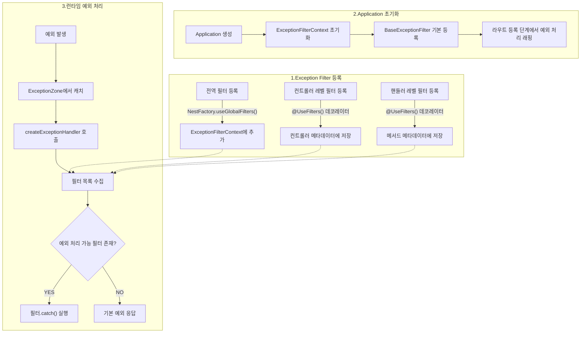
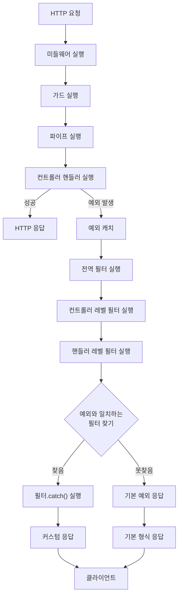

# Exception Filter

## Exception Filter 소개

Exception Filter는 예외 처리를 담당하는 필터입니다.

### Exception Filter 주요 특징
- 계층적 적용: 전역, 컨트롤러, 핸들러 레벨 순서로 적용
- 예외 필터링: `@Catch()` 데코레이터로 예외 필터링
- 커스텀 응답: 예외 처리 시 커스텀 응답 지원
- 예외 전파: 예외 처리 후 다음 필터로 전파 가능
- 컨텍스트 접근: ArgumentHost를 통해 컨텍스트 접근 가능

## 1. 핵심 구현 포인트
- `ExceptionFilter` 인터페이스 구현
  - `catch(exception: any, host: ArgumentsHost): void` 메서드를 통해 실제 예외 처리 로직 구현
  - `@Catch()` 데코레이터를 통해 타겟 예외 지정
- `ArgumentsHost` 인터페이스 구현
  - `switchToHttp()` 메서드를 통해 HTTP 컨텍스트로 변환
- `@UseFilters()` 데코레이터 사용
  - Class Level, Method Level, Global Level 적용 가능
- `ExceptionFilterContext` 클래스 사용
  - 예외 필터 등록 및 적용 로직 관리
  - 예외 필터 조회 및 적용 로직 관리

## 2. Exception Filter 등록 및 적용 로직

### 1. Exception Filter 등록 로직
- 전역 필터 등록
    - `NestFactory.useGlobalFilters()` 메서드를 통해 전역 필터 등록
    - `ExceptionFilterContext`에 필터 추가
    - 기본적으로 `BaseExceptionFilter`가 등록됨.

- 컨트롤러 레벨 필터 등록
    - `@UseFilters()` 데코레이터를 통해 컨트롤러 레벨 필터 등록
    - 컨트롤러 메타데이터에 필터 정보 저장

- 핸들러 레벨 필터 등록
    - `@UseFilters()` 데코레이터를 통해 핸들러 레벨 필터 등록
    - 메서드 메타데이터에 필터 정보 저장
### 2. Application 초기화 로직
- ExceptionFilterContext 초기화
- Router 등록시 요청 핸들러에 예외처리 래핑
- `createExceptionZone` 메서드를 통해 예외 처리 래핑

### 3. 예외 처리 과정
- `ExceptionsZone` 에서 모든 예외 catch
- `ArgumentsHost` 객체 생성 => 컨텍스트 정보 제공
- `ExceptionFilterContext.createExceptionHandler()`를 통해 예외 처리 handler 생성

- `getMethodFilters()` 메서드를 통해 메서드 레벨 필터 조회
- `getClassFilters()` 메서드를 통해 클래스 레벨 필터 조회
- `globalFilters` 전역 필터 수집
- `getFilterForException()` 메서드를 통해 예외 타입에 맞는 필터 조회
- 예외 처리 가능 필터 존재 시 `catch()` 메서드 실행
- 미존재시, 예외 재발생 또는 기본 예외 응답 처리.

## 3. 동작 프로세스

## 4. 구현 예시
