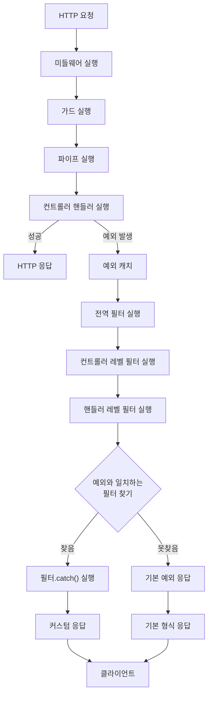

# Exception Filter

## Exception Filter 소개

Exception Filter는 예외 처리를 담당하는 필터입니다.

### Exception Filter 주요 특징
- 계층적 적용: 전역, 컨트롤러, 핸들러 레벨 순서로 적용
- 예외 필터링: `@Catch()` 데코레이터로 예외 필터링
- 커스텀 응답: 예외 처리 시 커스텀 응답 지원
- 예외 전파: 예외 처리 후 다음 필터로 전파 가능
- 컨텍스트 접근: ArgumentHost를 통해 컨텍스트 접근 가능

## 1. 핵심 구현 포인트
- `ExceptionFilter` 인터페이스 구현
- `ArgumentsHost` 인터페이스 구현
- `@Catch()` 데코레이터 사용
- `@UseFilters()` 데코레이터 사용
- `ExceptionFilterContext` 클래스 사용

## 2. Exception Filter 등록 및 적용 로직

## 3. 동작 프로세스

## 4. 구현 예시
