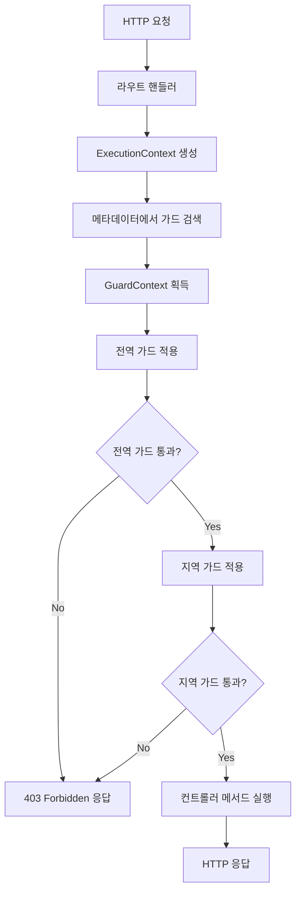
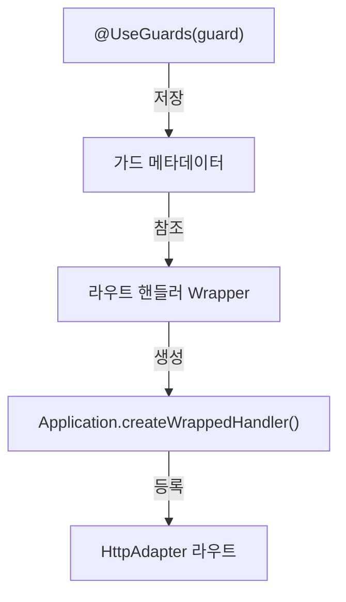
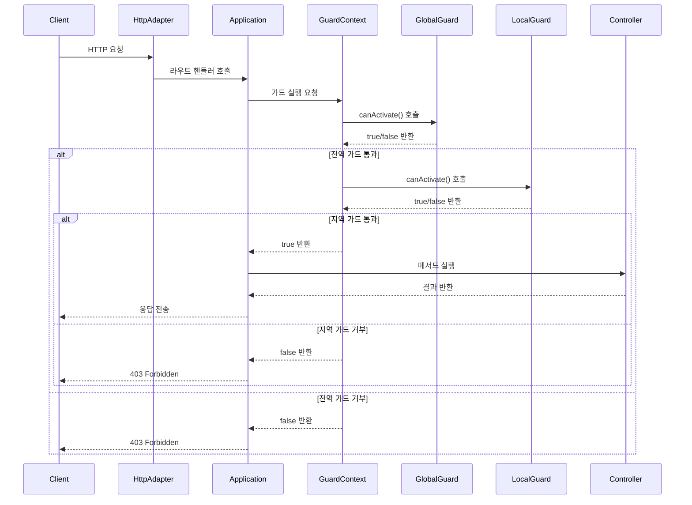

# Guard

## Guard 소개

Guard는 요청을 확인하고 허용 여부를 결정하는 기능을 제공합니다.

주로 인증, 권한 검사, 요청 유효성 검사 등 보안 관련 로직에 사용됩니다.

요청이 라우트 핸들러로 전달되기 전에 검사를 수행하여, 허용된 요청만 핸들러로 전달합니다.

## 1. 핵심 구현 포인트
- `canActivate` interface: 모든 Guard의 구현체
  - `canActivate()` 메서드를 통해 요청 허용 여부 결정
  - 허용되면 `true`, 거부되면 `false` 반환

- `GuardContext` 클래스: Guard singleton 
  - 전역 guard를 저장하고있는 Singleton 객체
  - `applyGuards()` 메서드를 통해 요청에 적용된 guard를 검사

- `ExecutionContext` 클래스: 요청 컨텍스트 정보를 제공하는 객체
  - 요청 객체, 응답 객체, 컨트롤러 클래스 정보 제공
  - guard 내부에서 요청 정보에 접근할 수 있도록.

- `UseGuards` 데코레이터: 가드 적용 선언
  - 컨트롤러 메서드 또는 클래스에 적용하여 가드 적용
  - 여러 가드를 배열로 전달하여 Guard Chain 구성 가능

- `Application` > `registerRoutes()` > `createWrappedHandler()` > `applyGuards()`
  - guard 처리 wrapper 생성 및 라우팅 연동
  - 라우트 핸들러 실행 전 가드 적용

## 2. Guard 관리 시스템
### 🌐 GuardContext (싱글톤 기반 관리)
- **싱글톤 패턴으로 구현**: 전체 애플리케이션에서 가드 컨텍스트 공유
- **전역 가드 저장소**: 모든 요청에 적용될 전역 가드 관리
- **가드 체인 실행 엔진**: 여러 가드를 순차적으로 적용하는 메커니즘 제공
  - 하나의 가드라도 false를 반환하면 즉시 실행 중단
  - 모든 가드가 true를 반환할 때만 요청 진행

```typescript
export class GuardContext {
  private static instance: GuardContext;
  private globalGuards: CanActivate[] = [];
  
  static getInstance(): GuardContext {
    if (!GuardContext.instance) {
      GuardContext.instance = new GuardContext();
    }
    return GuardContext.instance;
  }
  
  addGlobalGuard(guard: CanActivate): void {
    this.globalGuards.push(guard);
  }
  
  async applyGuards(guards: CanActivate[], context: ExecutionContext): Promise<boolean> {
    /* 전역 가드 적용 */
    for (const guard of this.globalGuards) {
      const result = await this.applyGuard(guard, context);
      if (!result) return false;
    }

    /* 지역 가드 적용 */
    for (const guard of guards) {
      const result = await this.applyGuard(guard, context);
      if (!result) return false;
    }

    return true;
  }
  
  private async applyGuard(guard: CanActivate, context: ExecutionContext): Promise<boolean> {
    const result = guard.canActivate(context);
    return result instanceof Promise ? result : Promise.resolve(result);
  }
}
```

## 3. Guard 등록 및 적용 로직
### 📌 글로벌 가드 등록
```typescript
NestFactory.useGlobalGuards(new AuthGuard());
```
```typescript
const guardContext = GuardContext.getInstance();
guardContext.addGlobalGuard(new AuthGuard());
```

### 📌 지역 가드 등록
- `@UseGuards()` 데코레이터를 사용하여 컨트롤러 메서드에 가드 적용
```typescript
@UseGuards(AuthGuard)
export class UserController {
  @Get()
  findAll() {
    return [];
  }
}
```
```typescript
@UseGuards(AuthGuard)
@Get(":id")
findById(@Param("id") id: string) {
  return this.userService.findById(id);
}
```


## 4. 동작 프로세스
1. 요청 수신 → 라우트 매핑 → ExecutionContext 생성
2. 가드 검색 → 전역 가드 적용 → 지역 가드 적용
3. 가드 통과 시 → 컨트롤러 메서드 실행 → 응답 반환
4. 가드 거부 시 → 403 Forbidden 오류 응답


## 5. 구현 예시
### AuthGuard 구현 예시(인증 확인)
```typescript
@Injectable()
export class AuthGuard implements CanActivate {
  constructor(private readonly jwtService: JwtService) {}

  canActivate(context: ExecutionContext): boolean | Promise<boolean> {
    const request = context.getRequest();
    const authHeader = request.headers.authorization;
    
    if (!authHeader || !authHeader.startsWith('Bearer ')) {
      return false;
    }
    
    try {
      const token = authHeader.split(' ')[1];
      const decoded = this.jwtService.verify(token);
      request.user = decoded; // 요청 객체에 사용자 정보 추가
      return true;
    } catch (e) {
      return false;
    }
  }
}
```
### RoleGuard 구현 예시(역할 검사)
```typescript
// 역할 데코레이터
export function Roles(...roles: string[]) {
  return (target: any, key?: string | symbol, descriptor?: TypedPropertyDescriptor<any>) => {
    Reflect.defineMetadata('roles', roles, descriptor ? descriptor.value : target);
    return descriptor ? descriptor : target;
  };
}

@Injectable()
export class RolesGuard implements CanActivate {
  canActivate(context: ExecutionContext): boolean {
    const handler = context.getHandler();
    const requiredRoles = Reflect.getMetadata('roles', handler) || [];
    
    if (!requiredRoles.length) {
      return true; // 역할 요구사항 없음 - 모두 허용
    }
    
    const request = context.getRequest();
    const user = request.user;
    
    if (!user || !user.roles) {
      return false; // 사용자 또는 역할 정보 없음
    }
    
    return requiredRoles.some(role => user.roles.includes(role));
  }
}
```

### 컨트롤러 예시
```typescript
@Controller('products')
@UseGuards(AuthGuard) // 컨트롤러 수준 인증 가드
export class ProductsController {
  constructor(private readonly productsService: ProductsService) {}

  @Get()
  findAll() {
    return this.productsService.findAll();
  }

  @Post()
  @UseGuards(RolesGuard) // 메서드 수준 역할 가드
  @Roles('admin') // 필요한 역할 정의
  create(@Body() createProductDto: CreateProductDto) {
    return this.productsService.create(createProductDto);
  }
}
```
