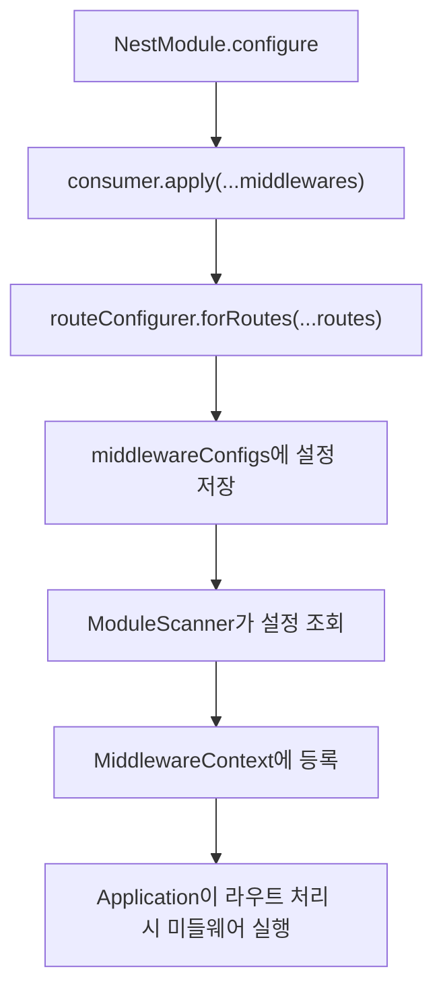
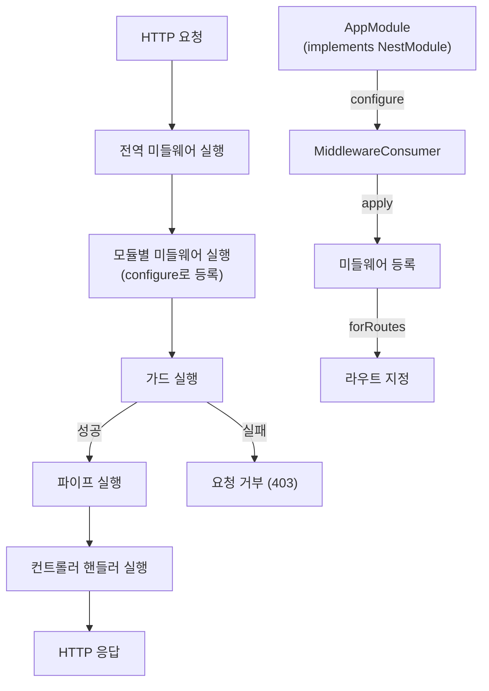

# Middleware

## Middleware 소개

Middleware는 요청을 처리하고 응답을 반환하는 기능을 제공합니다.

## 1. 핵심 구현 포인트

- `MiddlewareContext` 클래스: 미들웨어 실행 컨텍스트 관리
  - 전역 미들웨어와 모듈 미들웨어를 관리
  - 미들웨어 실행 함수를 생성하고, middleware chain을 실행

- `MiddlewareConsumer` 클래스: 모듈에 미들웨어 적용 관리
  - 미들웨어 구성 관리
  - builder pattern으로 미들웨어 적용 라우트 지정

- `MiddlewareRouteConfigurer` 클래스: 미들웨어 적용 라우트 지정
  - 미들웨어와 라우트 연결 정보 설정

- `Middleware` 인터페이스: 미들웨어 구현 인터페이스
  - 미들웨어 구현체가 구현해야 하는 인터페이스
  - 미들웨어 실행 함수를 생성하고, middleware chain을 실행

- `NestMiddleware` 인터페이스: 미들웨어 구현체가 구현해야 하는 인터페이스
  - 미들웨어 구현체가 구현해야 하는 인터페이스
  - 미들웨어 실행 함수를 생성하고, middleware chain을 실행

## 2. Middleware 등록 및 적용 로직

### Middleware 등록 과정 설명
#### 1. 미들웨어 적용 설정
- `consumer.apply(...middlewares)` 메서드를 통해 미들웨어 적용 설정
- middleware 배열을 전달받아 `MiddlewareRouteConfigurer` 인스턴스 생성

#### 2. 라우트 연결
- `routeConfigurer.forRoutes("path1")` 메서드를 통해 라우트 연결
  - { path: "path1"}
- `routeConfigurer.forRoutes(Controller)` 메서드를 통해 라우트 연결
  - { path: "prefix" } : Metadata 이용
- `routeConfigurer.forRoutes({ path: "path2", method: "GET"})` 메서드를 통해 라우트 연결
  - { path: "path2", method: "GET" }

#### 3. 미들웨어 설정 저장
- 변환된 route 정보와 미들웨어 배열을 결합하여 구성 정보 생성
- 해당 구성 정보를 `middlewareConfigs` 배열에 추가.

#### 4. 구성 활용
```typescript
// ModuleScanner의 configureMiddlewares 메서드 (요약)
private async configureMiddlewares(module: Type<any>): Promise<void> {
    const moduleInstance = this.container.getInstance(module);

    // 모듈이 NestModule 인터페이스 구현 확인
    if (moduleInstance && "configure" in moduleInstance) {
        const nestModule = moduleInstance as unknown as NestModule;
        const consumer = new MiddlewareConsumer();

        // 모듈의 configure 메서드 호출하여 미들웨어 설정
        nestModule.configure(consumer);

        // 설정된 미들웨어 구성 정보 조회
        const configs = consumer.getConfigs();

        // 미들웨어 컨텍스트 싱글톤 인스턴스 가져오기
        const middlewareContext = MiddlewareContext.getInstance();

        // 각 설정별로 미들웨어 등록
        configs.forEach((config) => {
            const { routes } = config;

            routes.forEach((routeInfo) => {
                const middlewaresForRoute = middlewareContext.getMiddlewaresForRoute(
                    routeInfo.path, 
                    routeInfo.method
                );
                
                // 모듈별 미들웨어 등록
                middlewaresForRoute.forEach((middleware) => {
                    middlewareContext.addModuleMiddlewares(module.name, [{
                        middleware,
                        routeInfo
                    }]);
                });
            });
        });   
    }
}
```

미들웨어 구성 등록 과정:
1. **모듈 확인**: NestModule 인터페이스 구현 여부 확인
2. **미들웨어 소비자 생성**: MiddlewareConsumer 인스턴스 생성
3. **설정 수집**: 모듈의 configure() 메서드 호출하여 미들웨어 설정
4. **컨텍스트 연결**: MiddlewareContext 싱글톤에 등록
5. **경로 매핑**: 각 라우트 정보와 미들웨어를 연결하여 등록
6. **모듈 관계 유지**: 모듈 이름으로 그룹화하여 모듈별 미들웨어 관리

이 과정을 통해 Application에서 라우트 요청을 처리할 때 해당 경로에 맞는 미들웨어를 자동으로 실행할 수 있습니다.

### 📌 전역 미들웨어 등록
```typescript
NestFactory.useGlobalMiddlewares(new AuthMiddleware());
```
```typescript
const middlewareContext = MiddlewareContext.getInstance();
middlewareContext.addGlobalMiddleware(new AuthMiddleware());
```

### 📌 지역 미들웨어 등록
- `@UseMiddleware()` 데코레이터를 사용하여 컨트롤러 메서드에 미들웨어 적용

## 4. 동작 프로세스



## 5. 구현 예시
### AuthMiddleware 구현 예시(인증 확인)
```typescript
@Injectable()
export class AuthMiddleware implements NestMiddleware {
  use(req: Request, res: Response, next: NextFunction) {
    const token = req.headers.authorization;
    if (!token) {
      return res.status(401).json({ message: 'Unauthorized' });
    }
    next();
  }
}
```

### 전역 미들웨어 등록
```typescript
NestFactory.useGlobalMiddlewares(new AuthMiddleware());
```

### 지역 미들웨어 등록
```typescript
@UseMiddleware(AuthMiddleware)
export class UserController {
  @Get()
  findAll() {
    return [];
  }
}
```