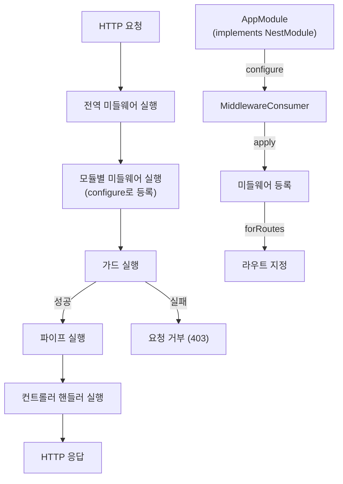

# Middleware

## Middleware 소개

Middleware는 요청을 처리하고 응답을 반환하는 기능을 제공합니다.

## 1. 핵심 구현 포인트

- `MiddlewareContext` 클래스: 미들웨어 실행 컨텍스트 관리
  - 전역 미들웨어와 모듈 미들웨어를 관리
  - 미들웨어 실행 함수를 생성하고, middleware chain을 실행

- `MiddlewareConsumer` 클래스: 미들웨어 적용 관리
  - 미들웨어 적용 범위 지정
  - 미들웨어 적용 순서 지정

- `MiddlewareRouteConfigurer` 클래스: 미들웨어 적용 라우트 지정
  - 미들웨어 적용 라우트 지정
  - 미들웨어 적용 라우트 순서 지정

- `Middleware` 인터페이스: 미들웨어 구현 인터페이스
  - 미들웨어 구현체가 구현해야 하는 인터페이스
  - 미들웨어 실행 함수를 생성하고, middleware chain을 실행

- `NestMiddleware` 인터페이스: 미들웨어 구현체가 구현해야 하는 인터페이스
  - 미들웨어 구현체가 구현해야 하는 인터페이스
  - 미들웨어 실행 함수를 생성하고, middleware chain을 실행

## 2. Middleware 등록 및 적용 로직
### 📌 전역 미들웨어 등록
```typescript
NestFactory.useGlobalMiddlewares(new AuthMiddleware());
```
```typescript
const middlewareContext = MiddlewareContext.getInstance();
middlewareContext.addGlobalMiddleware(new AuthMiddleware());
```

### 📌 지역 미들웨어 등록
- `@UseMiddleware()` 데코레이터를 사용하여 컨트롤러 메서드에 미들웨어 적용

## 4. 동작 프로세스



## 5. 구현 예시
### AuthMiddleware 구현 예시(인증 확인)
```typescript
@Injectable()
export class AuthMiddleware implements NestMiddleware {
  use(req: Request, res: Response, next: NextFunction) {
    const token = req.headers.authorization;
    if (!token) {
      return res.status(401).json({ message: 'Unauthorized' });
    }
    next();
  }
}
```

### 전역 미들웨어 등록
```typescript
NestFactory.useGlobalMiddlewares(new AuthMiddleware());
```

### 지역 미들웨어 등록
```typescript
@UseMiddleware(AuthMiddleware)
export class UserController {
  @Get()
  findAll() {
    return [];
  }
}
```