# 🚀 파이프 구현 가이드
## 공식문서 링크: https://docs.nestjs.com/pipes

## 🔍 1. 핵심 구현 포인트

`PipeTransform` 인터페이스: 모든 파이프의 기본 구현체
- 입력값을 원하는 형태로 변환하거나 유효성을 검사하는 메서드 제공
- `transform()` 메서드를 통해 파라미터 처리 로직 구현

`PipeContext` 싱글톤: 파이프 인스턴스 중앙 관리 시스템
- 전역 파이프를 저장하고 관리하는 싱글톤 객체
- 파이프 체인 실행을 위한 통합 메커니즘 제공
- `getInstance()`로 애플리케이션 전체에서 동일한 인스턴스 접근

`Application` 파이프 래핑: 라우팅 처리 자동화
- `createPipeHandler` 메서드로 컨트롤러 메서드를 파이프 실행 로직으로 래핑
- 파라미터 메타데이터 기반 파이프 적용 핸들러 생성
- HTTP 요청-파이프 처리-컨트롤러 실행 파이프라인 구성

`Param` 데코레이터: 매개변수 정보 추출
- HTTP 요청에서 특정 파라미터 추출 (@Param, @Query)
- 메타데이터를 통해 파라미터 정보 저장

`UsePipes` 데코레이터: 변환 로직 적용
- 컨트롤러나 핸들러에 파이프 적용
- 여러 파이프를 체인으로 구성 가능

라우팅 처리: 
- 컨트롤러 메서드 실행 전 파이프 자동 적용
- 요청-파이프-컨트롤러 파이프라인 구성

## 🏗️ 2. 핵심 컴포넌트

### 🔄 인터페이스 계층

- **PipeTransform**: transform 메서드 정의
  - `transform(value: any, metadata: ArgumentMetadata)`
- **ArgumentMetadata**: 파라미터 메타데이터 구조
  - `{ type, metatype, data }`

### 🧩 데코레이터 계층

- **파라미터 데코레이터**: 메타데이터 등록
  - 요청 데이터 위치와 타입 지정
- **파이프 적용 데코레이터**: 변환 로직 연결
  - 단일/다중 파이프 적용 지원

### ⚙️ 파이프 구현체

- **ParseIntPipe**: 문자열을 정수로 변환
  - 숫자가 아닌 입력 검증 및 변환
- **ValidationPipe**: 객체 유효성 검사
  - DTO 스키마 기반 데이터 검증

### 🛣️ 라우팅 시스템

- **메타데이터 기반 라우트 추출**
  - 데코레이터로 등록된 정보 활용
- **파이프 적용 및 매개변수 변환**
  - 컨트롤러 메서드 호출 전 파이프 실행

## 💡 3. 파이프 관리 시스템

### 🌐 PipeContext (싱글톤 기반 관리)

- **싱글톤 패턴으로 구현**: 전체 애플리케이션에서 파이프 컨텍스트 공유
- **전역 파이프 저장소**: 모든 요청에 적용될 전역 파이프 관리
- **파이프 체인 실행 엔진**: 여러 파이프를 순차적으로 적용하는 메커니즘 제공

```typescript
// PipeContext 핵심 구현
export class PipeContext {
  private static instance: PipeContext;
  private globalPipes: PipeTransform[] = [];
  
  static getInstance(): PipeContext {
    if (!PipeContext.instance) {
      PipeContext.instance = new PipeContext();
    }
    return PipeContext.instance;
  }
  
  addGlobalPipe(pipe: PipeTransform): void {
    this.globalPipes.push(pipe);
  }
  
  async applyPipes(value: any, pipes: PipeTransform[], metadata: ArgumentMetadata): Promise<any> {
    let transformedValue = value;
    
    // 1. 전역 파이프 적용
    for (const pipe of this.globalPipes) {
      transformedValue = await this.applyPipe(pipe, transformedValue, metadata);
    }
    
    // 2. 지역 파이프 적용
    for (const pipe of pipes) {
      transformedValue = await this.applyPipe(pipe, transformedValue, metadata);
    }
    
    // 3. 변환된 결과 반환
    return transformedValue;
  }
  
  private async applyPipe(pipe: PipeTransform, value: any, metadata: ArgumentMetadata): Promise<any> {
    const result = pipe.transform(value, metadata);
    return result instanceof Promise ? result : Promise.resolve(result);
  }
}
```

### 🔄 파이프 통합 흐름도

```mermaid
flowchart TD
    A[HTTP 요청] --> B[라우트 핸들러]
    B --> C[파라미터 추출]
    C --> D[파라미터 메타데이터 검색]
    D --> E{파이프 존재?}
    E -->|Yes| F[PipeContext 획득]
    E -->|No| K[원본 값 사용]
    F --> G[전역 파이프 적용]
    G --> H[지역 파이프 적용]
    H --> I[변환된 값 반환]
    I --> J[컨트롤러 메서드 실행]
    K --> J
```



## 🧰 4. 파이프 등록 및 라우팅 연동

### 📌 파라미터 데코레이터와 파이프 연결

- 파라미터 데코레이터(@Param, @Query, @Body)가 메타데이터에 파이프 정보 저장
- 파이프 인스턴스 또는 클래스를 데코레이터 두 번째 인자로 전달
- 동일 파라미터에 여러 파이프를 체인으로 적용 가능

```mermaid
flowchart TD
    ParamDecorator["@Param(name, pipe)"] --> |저장| Metadata["파라미터 메타데이터"]
    Metadata --> |참조| Handler["라우트 핸들러 Wrapper"]
    Handler --> |생성| Application["Application.createPipeHandler()"]
    Application --> |등록| HttpAdapter["HttpAdapter 라우트"]
```



### 🔄 Application의 파이프 처리 메커니즘

- **createPipeHandler**: 요청 처리 파이프라인에 파이프 로직 통합
- **라우팅 과정**: 컨트롤러 메서드 실행 전 파이프 적용 래퍼 등록
- **파이프 동적 적용**: 런타임에 메타데이터 기반으로 파이프 동적 실행

```typescript
// Application의 파이프 핸들러 생성 핵심 로직
private createPipeHandler(instance: any, methodName: string, paramsMetadata: any[]): Function {
  const pipeContext = PipeContext.getInstance();
  
  return async (req: any, res: any) => {
    const args = [];
    
    // 각 파라미터에 파이프 적용
    for (const metadata of paramsMetadata) {
      if (metadata) {
        const { type, data, pipes, index } = metadata;
        let value;
        
        // 1. 요청에서 값 추출
        switch (type) {
          case "body": value = req.body; break;
          case "query": value = req.query[data]; break;
          case "param": value = req.params[data]; break;
          default: value = undefined;
        }
        
        // 2. 파이프 적용
        const argumentMetadata = { type, data, metatype: undefined };
        const transformedValue = await pipeContext.applyPipes(value, pipes || [], argumentMetadata);
        
        // 3. 변환된 값을 인자 배열에 추가
        args[index] = transformedValue;
      }
    }
    
    // 변환된 인자로 컨트롤러 메서드 호출
    return await instance[methodName].apply(instance, args);
  }
}
```

## 🔄 5. 동작 프로세스

1. **요청 수신** → **라우트 매핑** → **매개변수 추출**
2. **파이프 검색** → **변환 로직 적용** → **유효성 검사**
3. **변환된 값으로 컨트롤러 메서드 호출** → **응답 반환**

## 📝 6. 구현 예시

```typescript
// ParseIntPipe 예시
class ParseIntPipe implements PipeTransform {
  transform(value: string, metadata: ArgumentMetadata) {
    const val = parseInt(value, 10);
    if (isNaN(val)) {
      throw new Error(`${value}는 숫자로 변환할 수 없습니다.`);
    }
    return val;
  }
}

// 컨트롤러에서 사용
@Get(':id')
findOne(@Param('id', ParseIntPipe) id: number) {
  return this.usersService.findOne(id);
}
```