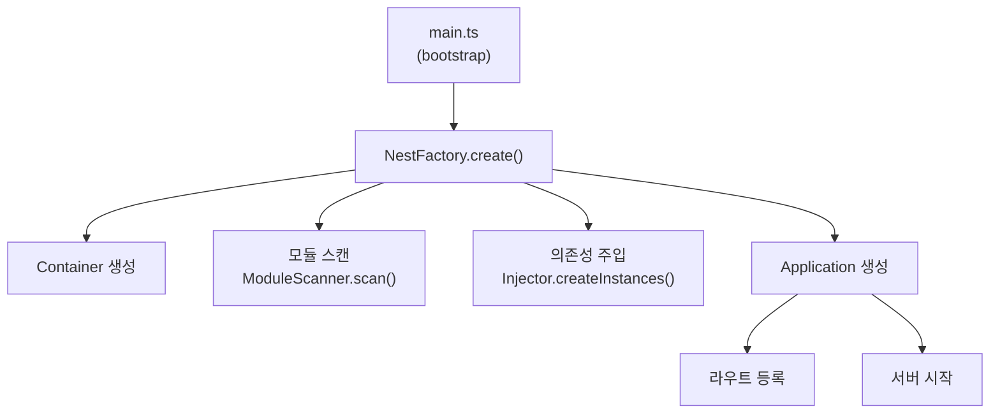
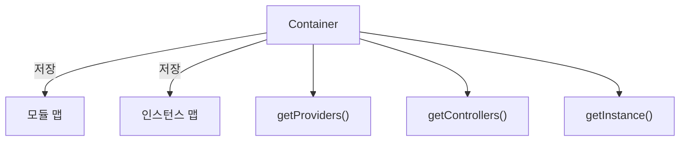
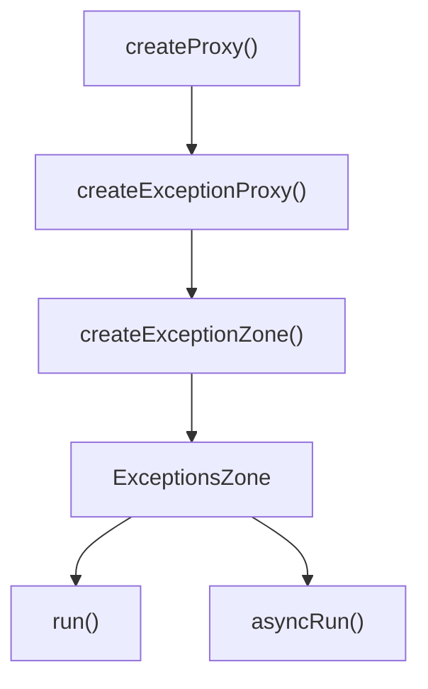
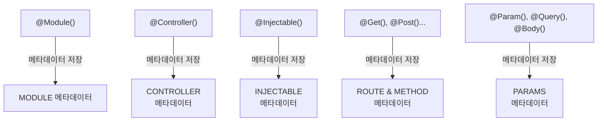
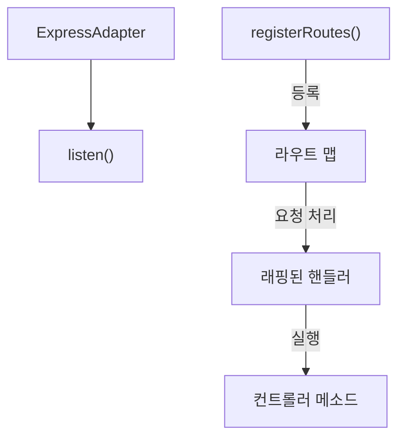
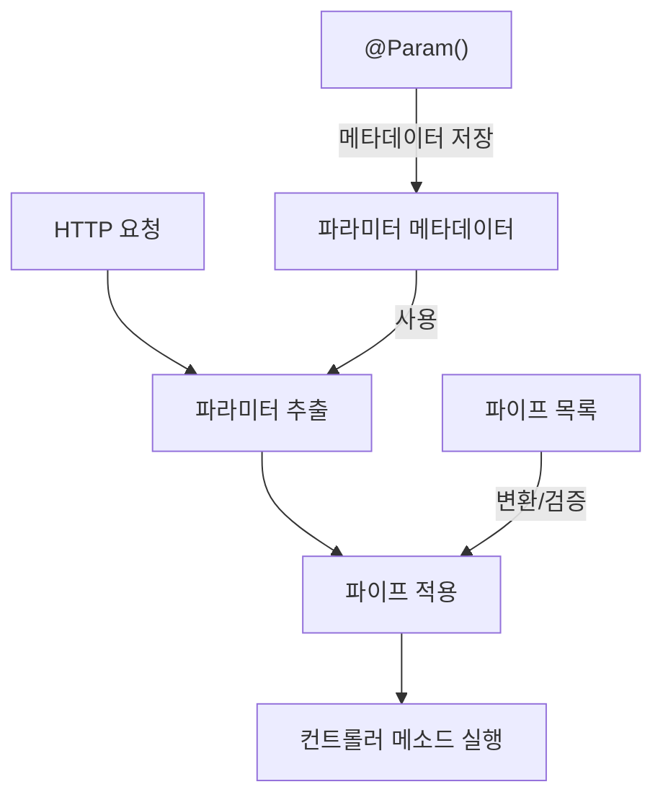

# Core 모듈 작동 원리

본 문서는 self_nest 프레임워크의 핵심 모듈들의 작동 원리와 흐름을 설명합니다.

## 애플리케이션 생성 흐름


### 주요 특징
- 부트스트래핑 패턴을 통한 애플리케이션 초기화
- 모듈 기반 구조로 애플리케이션 구성
- 자동 의존성 주입을 통한 인스턴스 생성
- 메타데이터 기반 라우트 등록

### 작동 원리
1. **초기화 단계**: 
   - `main.ts`에서 `bootstrap()` 함수 호출
   - `NestFactory.create(AppModule)` 호출로 애플리케이션 생성 시작

2. **컨테이너 생성**:
   - IoC 컨테이너 인스턴스 생성
   - 모듈, 프로바이더, 컨트롤러 등의 인스턴스를 관리할 저장소 준비

3. **모듈 스캐닝**:
   - `ModuleScanner.scan()`을 통해 루트 모듈부터 재귀적으로 모든 모듈 스캔
   - 모듈 메타데이터(@Module 데코레이터 정보) 분석
   - 모듈 간의 의존성 관계 구축

4. **의존성 주입**:
   - `Injector.createInstances()`를 통해 모듈, 프로바이더, 컨트롤러 인스턴스 생성
   - 생성자 매개변수 분석을 통한 의존성 자동 주입
   - 인스턴스 캐싱으로 싱글톤 패턴 구현

5. **애플리케이션 생성**:
   - HTTP 어댑터(ExpressAdapter) 설정
   - 애플리케이션 컨텍스트 초기화
   - 전역 예외 필터, 파이프, 가드 등 설정

6. **라우트 등록**:
   - 컨트롤러 메타데이터 분석을 통한 라우트 등록
   - HTTP 메서드, 경로, 핸들러 매핑
   - 파라미터 데코레이터 처리 로직 구성

7. **서버 시작**:
   - HTTP 서버 인스턴스 생성 및 포트 바인딩
   - 애플리케이션 라이프사이클 이벤트 발생

## IoC 컨테이너


### 주요 특징
- 의존성 역전 원칙(Dependency Inversion Principle) 구현
- 싱글톤 인스턴스 관리
- 순환 의존성 해결 지원
- 메타데이터 기반 모듈 관계 분석

### 작동 원리
1. **컨테이너 초기화**:
   - `moduleMap`: 모듈별 프로바이더와 컨트롤러 매핑 저장
   - `instanceMap`: 클래스와 인스턴스 간의 매핑 저장
   - 싱글톤 패턴으로 모든 인스턴스를 애플리케이션 라이프사이클 동안 유지

2. **모듈 등록**:
   - `registerModule(module)`: 모듈 등록 및 메타데이터 분석
   - 모듈의 프로바이더와 컨트롤러 매핑 구성
   - 모듈 간 관계(imports, exports) 처리

3. **프로바이더/컨트롤러 조회**:
   - `getProviders(module)`: 특정 모듈의 프로바이더 목록 반환
   - `getControllers(module)`: 특정 모듈의 컨트롤러 목록 반환
   - 메타데이터를 통해 등록된 정보 활용

4. **인스턴스 생성 및 관리**:
   - `getInstance(target)`: 클래스의 인스턴스 반환 (없으면 생성)
   - 생성자 매개변수 분석 및 의존성 자동 주입
   - 생성된 인스턴스 캐싱으로 싱글톤 유지
   - 프로바이더 간 의존성 그래프 구성 및 해결

5. **의존성 해결 방법**:
   - 생성자 매개변수의 타입 정보 활용
   - 필요한 의존성을 먼저 생성하고 주입하는 재귀적 접근
   - 의존성 트리 순회를 통한 필요 인스턴스 생성

## 예외 처리 메커니즘


## 데코레이터 & 메타데이터


## HTTP 처리


## 파라미터 데코레이터 시스템


파라미터 데코레이터는 컨트롤러 메소드의 매개변수에 HTTP 요청 데이터를 바인딩하고 필요에 따라 변환/검증하는 역할을 담당합니다.

### 주요 특징
- Factory 패턴의 중첩 사용 (Factory of Factory)
- 메타데이터 기반 파라미터 정보 저장
- 파이프를 통한 데이터 변환 및 검증 지원
- 다양한 요청 데이터 소스 지원 (path, query, body)

### 작동 원리
1. **메타데이터 등록**: 
   - 파라미터 데코레이터가 적용되면 매개변수의 위치, 타입, 파이프 등의 메타데이터 등록
   - `METADATA_KEY.PARAMS` 키를 사용하여 메소드별 파라미터 메타데이터 배열 저장

2. **요청 처리 시**:
   - HTTP 요청이 컨트롤러 메소드로 라우팅될 때 파라미터 메타데이터 검색
   - 메타데이터 기반으로 요청에서 적절한 값 추출 (req.params, req.query, req.body)
   - 연결된 파이프를 통해 값 변환/검증
   - 변환된 값으로 컨트롤러 메소드 호출

### 사용 예시
```typescript
@Controller('users')
export class UserController {
  // URL 경로 파라미터 사용
  @Get(':id')
  findOne(@Param('id', ParseIntPipe) id: number) {
    return `사용자 ID: ${id}`;
  }
  
  // 쿼리 파라미터 사용
  @Get()
  findAll(@Query('page') page: string, @Query('limit') limit: string) {
    return `페이지: ${page}, 한계: ${limit}`;
  }
  
  // 요청 본문 사용
  @Post()
  create(@Body(ValidationPipe) userData: any) {
    return `사용자 생성: ${JSON.stringify(userData)}`;
  }
}
```

## 주요 패턴
- 모듈화
- 의존성 주입
- 데코레이터 패턴
- 팩토리 패턴
- 예외 처리
- 모듈 스캐닝 