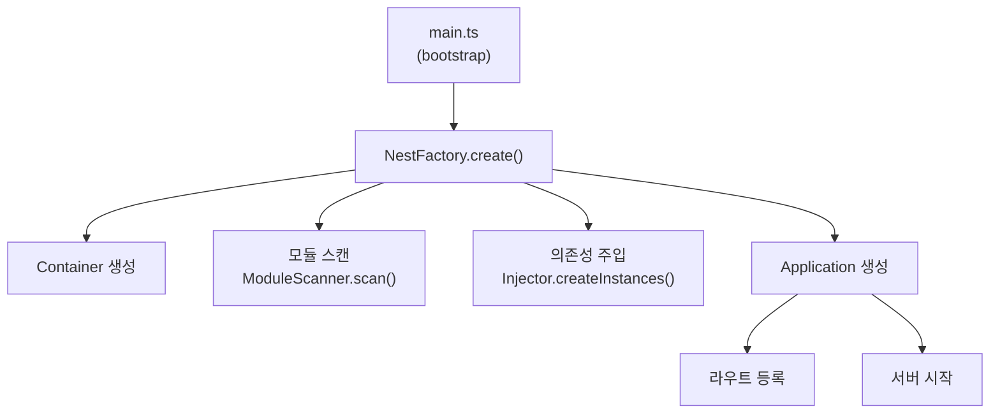
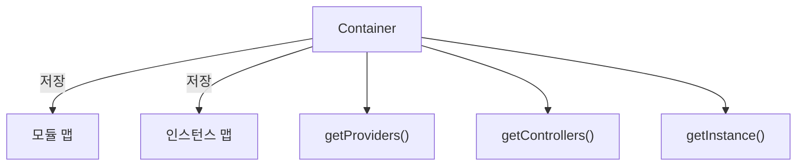
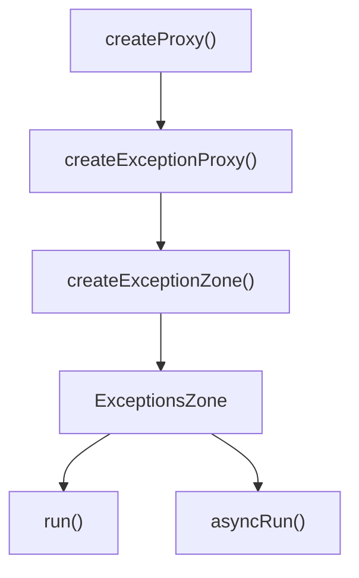
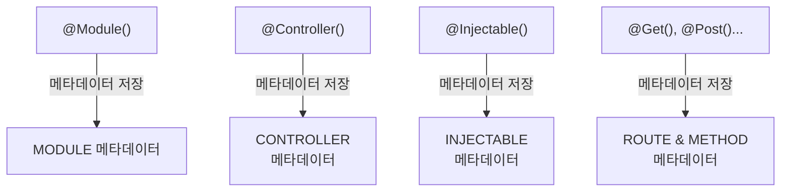
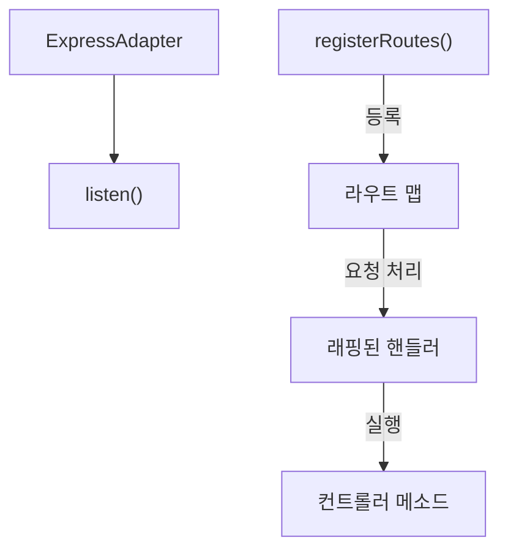

# Core 모듈 작동 원리

본 문서는 self_nest 프레임워크의 핵심 모듈들의 작동 원리와 흐름을 설명합니다.

## 애플리케이션 생성 흐름

## IoC 컨테이너

## 예외 처리 메커니즘

## 데코레이터 & 메타데이터

## HTTP 처리

## 주요 패턴
- 모듈화
- 의존성 주입
- 데코레이터 패턴
- 팩토리 패턴
- 예외 처리
- 모듈 스캐닝 